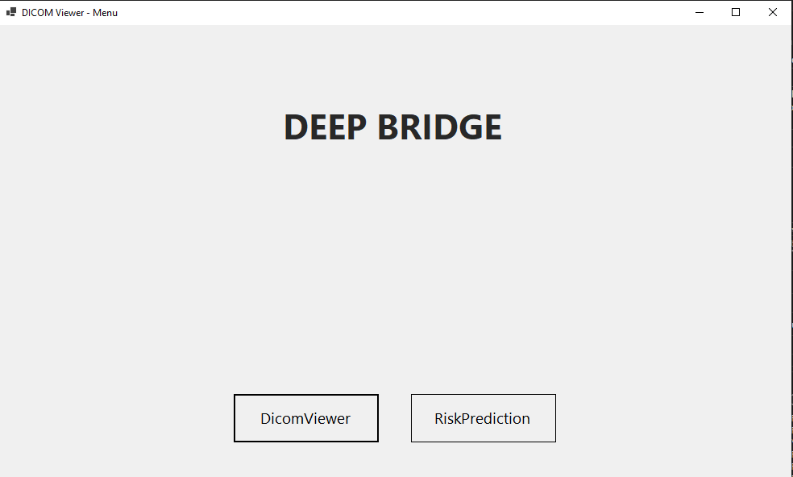
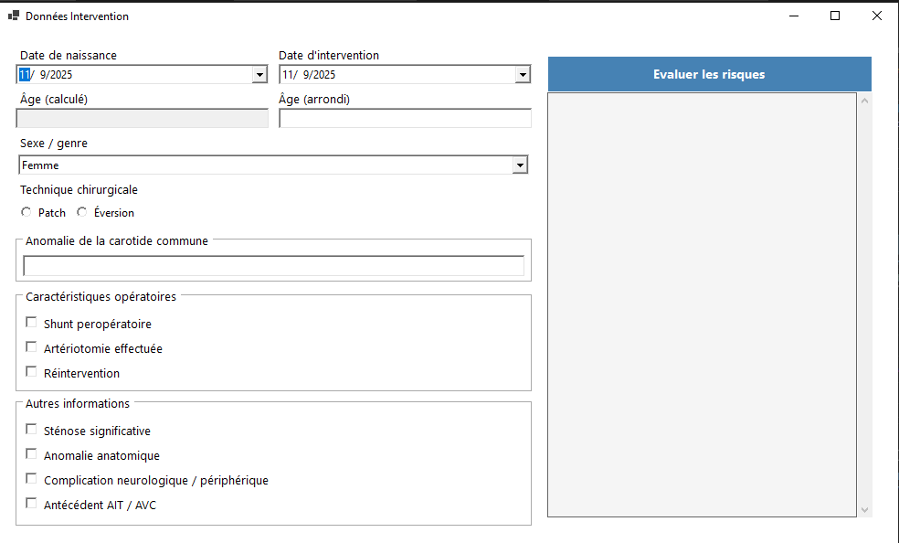
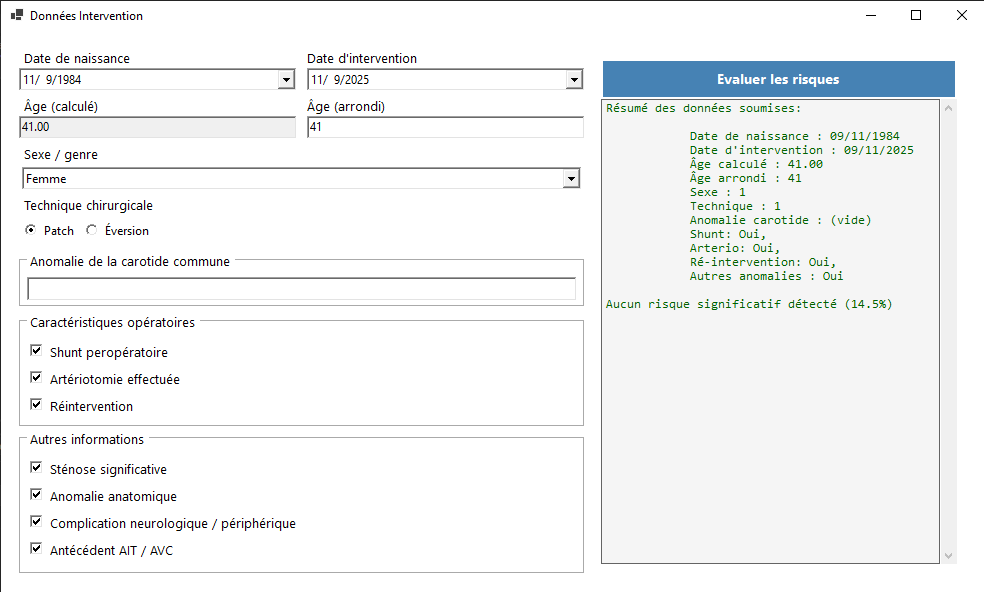

# README - DeepBridge DICOM Viewer + Risk Prediction

## Introduction

Ceci est une application développée dans le but d'assister les médecins dans le traitement de la sténose carrotidienne. Elle comprend deux outils, visualisation d'images DICOM en 2D et 3D, et un module de prédiction des risques liés à l'opération chirurgicale de cette pathologie. Elle a été développée dans le cadre du projet DeepBridge, un projet de recherche en collaboration avec le CHU de Nice.

## Membres

- Raharison amboara Tiana Avotra
- Rahajason Aroniaina Saotra
- Ravelomahefa Serge
- Andriamboavonjy Tafitasoa Tojohery Sambatra
- Zahirhoussen Zoulfikar

## Installation et Configuration

## Prérequis

Pour pouvoir exécuter et développer ce projet, vous aurez besoin des éléments suivants :

- **.NET SDK** : version 8.0 ou supérieure
- **Visual Studio** : 2022 ou version ultérieure avec les charges de travail suivantes :
  - Développement .NET Desktop
  - Développement Windows Universal Platform
  
- **Packages NuGet** (installés automatiquement via le fichier projet) :
  - EvilDICOM (version 3.0.8998.340)
  - OpenTK (version 4.9.3)
  - OnnxRuntime (version 1.23.2)

### DICOM Viewer

Ce projet est une continuation du DICOM Viewer développé précédemment par COLIN, CHOUBRAC et BARRALI dans le cadre du TPI Deep Bridge.

Notre travail s’appuie directement sur leur base, en y ajoutant un nouveau module de prédiction des risques opératoires à l’aide d’un modèle Random Forest Classifier.

Pour l’installation et la configuration initiale du visualiseur DICOM (gestion des dépendances, chargement des séries, rendu 2D/3D, etc.), veuillez vous référer au dépôt du projet original :

[DICOM Viewer – Projet initial](https://discord.com/channels/1375481661751431168/1375485570662404116/1384825006919258192)

## RiskPrediction - Vues de l'application

### 1. Vue menu principal


La première vue de l'application vous permet de naviguer entre DICOM Viewer et Risk Prediction. Pour informations complementaires sur DICOM Viewer voir le [repository initial de COLIN, CHOUBRAC et BARRALI](https://discord.com/channels/1375481661751431168/1375485570662404116/1384825006919258192), la suite du README se concentre sur Risk Prediction.

### 2. Vue Formulaire Risk Prediction


Cette vue permet de saisir les informations cliniques du patient nécessaires pour la prédiction des risques opératoires. Les informations à remplir se limitent à ce qui est connu avant l'opération, données pré-operatoires.

Les champs incluent l'âge, le sexe, la techniques chirurgical, les antécedents et la présence d'anomalies.


Si les champs obligatoires sont omit, il y a une erreur avant soumission. 


Si aucune erreur, l'application affiche le pourcentage de risque de complication liés à l'opération. Le pourcentage change en fonction des informations insérée, les champs repré sente les features du modele de prédiction. 

RiskPrediction aide le médecin à se projeter dans la prise de décision. Le modèle fournit une information objective, en fonction des données d'entrainement.

## RiskPrediction - Random Forest Classifier

Pour la prédiction, l'application utilise un modèle en format .ONNX. Le fichier se situe à la racine de l'application `random_forst_model.onnx`. Le fichier `DeepBridgeWindowAppCore.csproj` a été modifier pour ajouter cette section.

```C#
  <ItemGroup>
    <Compile Update="CreditsForm.cs">
      <SubType>Form</SubType>
    </Compile>
    <Compile Update="RiskPrediction.cs" />
  </ItemGroup>
  <ItemGroup>
    <Content Include="random_forest_model.onnx">
      <CopyToOutputDirectory>
        Always
      </CopyToOutputDirectory>
    </Content>
  </ItemGroup>
```

Si vous renommer ou utilisez un autre modèle, modifier le nom du fichier ici `<Content Include="random_forest_model.onnx">`

> Pour informations sur le modèle de prédiction, voir le README du dossier TPI-python.
